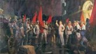
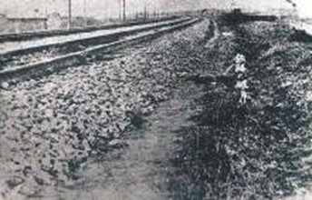

中国近代史导论

An introduction to Modern History of China

<iframe src='https://view.officeapps.live.com/op/embed.aspx?src=https://jihulab.com/wxq/docs/-/raw/main/%E6%A8%A1%E5%9D%97%E4%B8%80/1%E4%B8%AD%E5%9B%BD%E8%BF%91%E4%BB%A3%E5%8F%B2%E5%AF%BC%E8%AE%BA%EF%BC%88%E5%88%9D%E4%B8%AD%EF%BC%89.pptx' width='100%' height='534' frameborder='0'>
</iframe>

# 中国近代史，是指1840年鸦片战争(First Opium War)至1949年中华人民共和国成立(founding of the People\'s Republic of China)这个时期的历史，前后大约110年。从历史学科来说，中国近代史就是以1840-1949年这110年的中国历史为研究对象(object)的。

这是中国逐渐沦为半殖民地半封建社会(semi-colonial and semi-feudal
society)的历史，也是中国人民追求国家独立和民族复兴(Pursue national
independence and national
rejuvenation)的历史。中国近代史分为前后两个阶段，从1840年鸦片战争(First
Opium War)到1919年五四运动(May Fourth
Movement)前夕，是旧民主主义革命阶段(The stage of the old Democratic
revolution)；从1919年五四运动(May Fourth
Movement)到1949年中华人民共和国成立(founding of the People\'s Republic
of China)前夕，是新民主主义革命阶段(The stage of the new Democratic
revolution)。

旧民主主义革命：资产阶级（bourgeoisie）领导的反对外国侵略和本国封建统治（Oppose
foreign aggression and feudal rule at home）的革命。

新民主主义革命：无产阶级（proletariat）领导的人民大众的彻底的（thorough）反对帝国主义和封建主义（Fight
against imperialism and feudalism）的革命。

旧民主主义革命（the old Democratic revolution）

旧民主主义革命包含了农民阶级（peasant class）的反抗革命(resistant
revolution)，以及资产阶级领导的、以建立资本主义社会和资产阶级专政的国家(Establishing
a capitalist society and a state under the dictatorship of the
bourgeoisie)为目的的资产阶级革命(bourgeois
revolution)，这些都是反对外国侵略和本国封建统治(Oppose foreign
aggression and feudal rule at home)的革命。

1840年起至1919年，中国人民同外国侵略者(foreign
invaders)，同本国剥削者(Native exploiters)进行了艰苦的革命斗争(Arduous
revolutionary struggle)。

这段时期大致可分为：

1840-1901：以太平天国(Taiping Rebellion)和义和团运动(Yihetuan
movement)为代表的农民革命(revolution of peasants)；

1901-1919：资产阶级民主革命(bourgeois-democratic
revolution)。其中后一个阶段还可以分为由资产阶级领导的旧民主主义革命时期（1901-1919）。这期间先后出现了六次较大的运动，代表着历史的发展方向，勾画出这一历史时期的主要脉络，形成这一时期的主旋律。(During
this period, six major movements appeared successively, representing the
direction of historical development.)

### 太平天国运动（Taiping Rebellion）：反封建反侵略的农民革命战争（The peasant revolutionary war against feudalism and aggression）

> 
>
> **太平天国起义**

### 

### 洋务运动（westernization movement）：地主阶级（landlord class）的一次自救运动(movement to save themselves)

> 
>
> 张之洞视察汉阳铁厂

### 戊戌变法运动（The Hundred Day Reform Movement）：资产阶级政治改良（improved）的首次尝试 (the first attempt)

> 
>
> 戊戌六君子

### 义和团运动（Yihetuan Movement）：农民反帝爱国运动（The anti-imperialist patriotic movement）

> 
>
> **八国联军镇压义和团**

### 

### 辛亥革命（the Revolution of 1911）：伟大的资产阶级民主革命（bourgeois-democratic revolution）

> 
>
> **辛亥革命浮雕** 

### 新文化运动（the New Culture Movement (around the time of the May 4th Movement in 1919)）：资产阶级民主主义性质的思想文化运动

> 
>
> **《新青年》杂志**

新民主主义革命（the new Democratic revolution）

新民主主义革命是指在帝国主义(imperialism)和无产阶级革命(proletarian
revolution)时代，殖民地半殖民地国家(Colonial and semi-colonial
countries)中的无产阶级领导的资产阶级民主革命。其所谓\"新\"，是相对于17-18世纪欧美国家发生的资产阶级领导的，旨在推翻封建专制主义压迫(Overthrow
feudal autocratic oppression)，确立资产阶级政治统治(Political rule by
the
bourgeoisie)的旧民主主义革命。中国的新民主主义革命是从1919年五四运动开始的，在此之前的近代以来的资产阶级民主革命为中国的旧民主主义革命。新民主主义革命是无产阶级领导的(lead
by the
proletariat)、人民大众的(demotic)、反对帝国主义(anti-imperialism)、封建主义(anti-feudalism)、官僚资本主义(anti-bureaucrat
capitalism)的革命。它的目标是无产阶级（通过中国共产党Communist Party of
China,
CPC）牢牢掌握革命领导权，彻底完成革命的任务，并及时实现由新民主主义向社会主义的过渡(The
transition from new democracy to
socialism)。1949年中华人民共和国的成立标志着我国新民主主义革命的基本结束和社会主义革命的开始(It
marks the end of the new democratic revolution and the beginning of the
socialist revolution.)。

1919年爆发的五四运动是中国从旧民主主义革命走向新民主主义革命的转折点(turning
point)；1949年，中华人民共和国的成立标志着中国新民主主义革命的基本胜利(Basic
victory)。

第一阶段（1919\~1927）

这一阶段被称为"大革命"(great
revolution)时期，1924\~1927年为国民革命(national
revolution)时期，其中1926\~1928年为北伐战争(the Northern
Expedition)时期。

> **五四运动与国民大革命的兴起（1919-1927）**

1919年爆发的五四运动成为新民主主义革命的开端，并直接促成(Directly
contribute to)1921年7月23日中国共产党第一次全国代表大会召开(the hold of
The first National Congress of the Communist Party of China
)，宣告中国共产党的成立(Proclaimed the founding of the Communist Party
of China)，新民主主义革命拥有了坚强的领导核心(the strong core of
leadership)。此后，中国共产党不断发起工人暴动(Initiate workers\'
riots)，反抗北洋政府统治(They rebelled against the Northern
government.)。1924年国民党"一大"后，国民党与共产党实现第一次合作(The
Kuomintang and the CPC cooperated for the first
time)，促成1926年开始的北伐战争的胜利进行。1927年，在国民党右派(Kuomintang
rightists)的破坏和中共内部右倾错误思想(Wrong rightist thinking in the
CPC)的影响下，接连出现四一二反革命政变(Counterrevolutionary coup d
\'etat in April 12)和七一五反革命政变(Counterrevolutionary coup d \'etat
in July 15)，第一次国共合作(the first Kuomingtang-Communist Party
cooperation)破裂，国民大革命宣告失败。

第二阶段（1927\~1937）

> 
>
> **土地革命战争时期（1927-1937）**

这一阶段被称为土地革命战争时期(Agrarian Revolutionary War)。

由1927年8月1日南昌起义(Nanchang
Uprising)开始，中国共产党代表人民群众打响了武装反抗国民党反动统治的第一枪(It
fired the first shot of an armed revolt against kuomintang reactionary
rule.)。1927年9月秋收起义(the Autumn Harvest
Uprising)后，确定了"农村包围城市，武装夺取政权(to encircle the city with
the country and to seize power by armed
force.)"的革命道路，开辟了以井冈山为代表的无数农村革命根据地(Rural
revolutionary base areas)，并成功粉碎（smash）国民党数次"围剿（encircle
and
suppress）"。1933年至1934年，由于王明\"左倾\"错误路线影响，第五次反围剿失败。1934年10月开始工农红军（The
red army of workers and peasants）被迫进行长征（Long
March）。1936年10月三大主力会师甘肃会宁，标志着长征的胜利结束。

在此期间，日本发动九一八事变（Mukden
Incident），侵占中国东北并虎视眈眈、不断向南推进。中共主张停止内战，一致抗战（Stop
the civil war and fight in unison）；而国民党为了稳固政权（Stable
regime）采取了"攘外必先安内（Resisting foreign aggression Home
Safe）"的不抵抗政策（Policy of non-resistance），最终导致国土沦丧（The
decay）。1936年西安事变（Xi\'an Incident）和平解决（amicable
settlement）后，国共第二次合作初步形成（The second kuomintang-Communist
cooperation took shape.）。

第三阶段（1931\~1945）

> 
>
> **抗日战争时期（1931-1945）**

这一阶段被称为抗日战争时期。

1931年9月18日，以"九一八事变"为起点（Take \"918 Incident\" as the
starting point），中国人民进入了艰苦卓绝的十四年抗战时期（the
Anti-Japanese War of fourteen
years）。以国共第二次合作为标志（mark），抗日民族统一战线形成(The
Anti-japanese national United front was formed)，全国人民团结一心（The
whole nation is united as one），最终打败了日本侵略者（The Japanese
invaders were finally defeated），维护了国家的主权独立（Safeguarding the
sovereignty and independence of the country），极大地提高了国际地位（It
has greatly enhanced its international
standing）。中国在此后成为联合国安理会五大常任理事国之一（One of the
five permanent members of the United Nations Security Council）。

第四阶段（1945\~1949）

这一阶段被称为解放战争时期。

> 
> **全国解放战争时期（1945-1949）**

1945年抗战胜利(victory of the Anti-Japanese
War)后，国共进行重庆谈判(Chongqing Negotiations)，签订关于和平建国(The
founding of the
peace)问题的协定（即"《双十协定》"）。1946年，蒋介石撕毁《双十协定》，发动内战(Cygnaran
Civil)。在中国共产党的英明领导和人民群众的大力支持下(Under the wise
leadership of the COMMUNIST Party of China and the strong support of the
people)，解放战争(war of liberation)最终获得胜利，中国人民解放军(Chinese
People\'s Liberation
Army)解放了除台湾、西藏以及港澳以外全部的大陆领土（1951年西藏和平解放，香港和澳门分别于1997、1999年回归祖国）。1949年10月1日，中华人民共和国、中央人民政府成立，标志着新民主主义革命的基本胜利(It
marked the basic victory of the new democratic revolution)。
