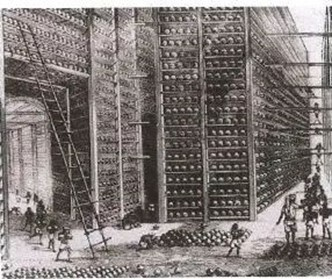
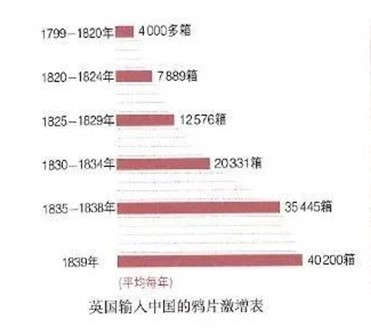
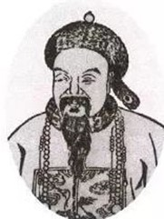
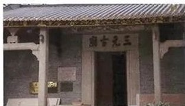
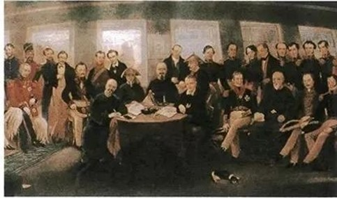
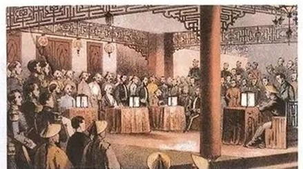

# 鸦片战争(The Opium War)

<iframe src='https://view.officeapps.live.com/op/embed.aspx?src=https://jihulab.com/wxq/docs/-/raw/main/%E6%A8%A1%E5%9D%97%E4%B8%80/2%E9%B8%A6%E7%89%87%E6%88%98%E4%BA%89%EF%BC%88%E5%B0%8F%E5%AD%A6%EF%BC%89(1).pptx' width='100%' height='534' frameborder='0'>
</iframe>

### 背景介绍：中国开始沦为半殖民地半封建社会(Background information: China started to be a semi-colonial and semi-feudal society)

19世纪中期，完成了工业革命的英国，资本主义经济迅速发展。(In the middle
of the 19^th^ century, capitalism developed rapidly in Britain, which
has just finished the Industrial
Revolution.)西方各国为了开拓海外市场和掠夺生产资料，把侵略扩张的矛头指向幅员辽阔的中国。(In
order to expand overseas markets and plunder means of production,
western countries turned their attention to China, a country with a vast
territory. )1840年，英国发动鸦片战争。(In 1840, Britain waged the Opium
War.)1856年，英法联合发动了第二次鸦片战争。(In 1856, Britain and France
waged the second Opium War
together.)中国被大炮打开国门，丧失了大量主权，开始沦为半殖民地半封建社会。(With
sovereignty losing, China was forced to accept foreigners' living and
trading by heavy attack, and stepped into the era of semi-colonial and
semi-feudal
society)在内忧外患、民生痛苦中爆发了洪秀全领导的太平天国运动。（Led by
Hong Xiuqian, Taiping Rebellion broke out in the situation of internal
disorder and foreign invasions.
）这是一次规模宏大的农民战争，席卷了大半个中国，沉重打击了清朝统治者和外国侵略势力。(As
a large-scale movement, which even covered more than a half of Chinese
territory, that rebellion greatly weakened the forces of Qing dynasty
rulers and foreign invaders.)

## 过程(Process)

1842年8月29日，清政府的谈判代表在英国人起草的《南京条约》上签字画押，停泊在南京江面的英国军舰皋华丽号上响起三声礼炮。(On
August the 29th, 1842, with three salutes thundered on the British
warship HMS Cornwallis, the negotiator, who represented the Qing
Dynasty, put his signature on *the Treaty of Nanjing* which was drafted
by British.)这标志签字仪式的结束，也标志第一次鸦片战争的终结。(The
finish of the signature ceremony marked the ending of the Opium War.
)我们不禁要问：英国为什么要发动这场战争？清军为什么会在战争中失败？《南京条约》包括哪些内容？为什么说鸦片战争是中国近代史的开端？(We
cannot help asking: Why did Britain wage the war? Why did the Qing
troops lose in the war? What were contained in *the Treaty of Nanjing*?
Why do we call the Opium War as the beginning of the Chinese Modern
History.)

### 鸦片走私与林则徐禁烟(Opium smuggling and Lin Zexu's opium ban )

鸦片战争爆发前，清朝统治下的中国危机四伏。(Before the Opium War, China
was in danger under the Qing Dynasty
ruling.)西方已经进入资本主义时代，英国成为头号工业强国，并不断向外进行殖民主义扩张，掠夺殖民地。(The
western countries have stepped into the era off capitalism. As the most
industrial-developed country, Britain consistently expanded outwards and
established its colonies.
)英国为了开辟海外市场，向中国运来呢绒、布匹，但遭到中国男耕女织式的自然经济的排斥，严重滞销。(In
order to open overseas markets, Britain exported woollen fabric and
cloth. But they failed to sell well, because they were badly excluded by
Chinese natural economic form, in which men tilled and women
wove)而中国向英国输出的茶叶、生丝等，销路旺盛。(However, commodities
which were exported from China to Britain, such as tea and raw silk, had
a good selling.)在正当贸易中，中国处于明显的出超①地位。(In the legal
trade, China had obvious trade
surplus①.)为了改变这种不利局面，英国向中国大量走私鸦片②.(Aiming to
change their situation, Britain smuggle a lot of opium to
China.)从18世纪末到鸦片战争前夕，走私到中国的鸦片达40多万箱③,从中国掠走3亿至4亿银元。(From
the end of the 18^th^ century to the eve of the Opium War, more than
400,000 cases of opium has been smuggled to China, which pillaged
300,000,000 to 400,000,000 ounces of silver from China.)

1.  出超，又称"贸易顺差"，指在一定时间内（一般为一年）一国的商品出口额高于进口额。如果进口额高于出口额，则为"入超"，又称"贸易逆差"。(Trade
    surplus, also called"Favourable Balance of Trade", refers to the
    situation that the export earnings of a country is higher than its
    import spendings in a particular period of time. If its import
    spendings is higher than its export earnings, the situation is
    called"trade deficit"or "unfavourable Balance of Trade".)

2.  鸦片俗称大烟，是一种麻醉毒品。(Opium is a kind of narcotic
    drugs.)吸食鸦片又叫"抽大烟"，极易上瘾。(Taking opium can easily
    become people to
    addicts.)期吸食，不仅耗费大量钱财，最终导致倾家荡产，而且使人变得面黄肌瘦，目光呆滞，有气无力，甚至丧失先天免疫力，患染各种疾病，直至死亡。(The
    harmful effects of taking opium include not only a large quantity of
    money being lost which leads to the bankruptcy, but also the
    deterioration of physical condition and even the death.)

3.  每箱鸦片重50或60千克，40多万箱鸦片共2000多万千克。(Each box of opium
    weight 50 to 60 kilograms, and more than 40,000 cases of opium
    weight over 2,000,000 kilograms in total.)

鸦片泛滥给中华民族带来深重灾难。(The wide spread of opium brought a
terrible disaster to the Chinese
people.)白银大量外流直接威胁到清政府的财政(The outflow of a large
quantity of money threatened the finance of Qing government directly;
)；许多官员、士兵吸食鸦片，不但严重摧残了他们的体质，更导致政治腐败和军队战斗力削弱。(many
officers and soldiers were taking opium, which did not only affected
their physical conditions badly, but also resulted in the political
corruption and the decrease of combat
effectiveness.)这些都引起统治阶级中一些有识之士的重视。(All of these
aroused the attention of some wise people in the ruling
class.)1838年底，道光帝①派力主禁烟的林则徐为钦差大臣，前往广东查禁鸦片。(In
the end of 1838, the Daoguang Emperor dispatch Lin Zexun, who advocate
banning the opium, as a imperial commissioner to ban opium in Canton.)

图 1东印度公司鸦片仓库

##### 人物扫描(An introduction of a Critical Person)

图 2林则徐

林则徐，福建侯官人。为官正直清康。(Lin Zexu, from Houguan in Fujian
Province, behaved with
integrity.)在江苏按察使任内，决冤狱，抑豪强，被百姓称为"林青天"。(When
he worked in Jiangsu, he has corrected unjust cases and suppressed local
bullies, and he was thus called "Lin
Qingtian".)任湖广总督期间，在汉口、长沙等地捉拿烟贩，收缴烟土、烟枪，设禁烟局，配制戒烟药丸，勒令吸食者限期戒烟，取得明显成效。(When
he took charge of Huguang area, he did well on opium banning
work.)同时，还在给道光帝的上书中指出：如果听任鸦片流毒，"是使数十年后，中原几无可以御敌之兵，且无可以充饷之银"。(Meanwhile,
he also elaborated the Daogaung Emperor the harmful effects of opium.)

##### 材料研读(Material Reading)

臣窃见近来银价递增，每银一两，易制钱一千六百有零，非耗银于内地，实漏银于外夷

也。······其初不过纨袴子弟，习为浮靡，尚知敛戢。剐后上自官府缙绅，下至工商优吏，以及妇女僧尼道士，随在吸食。··..··以中国有用之财，填海外无穷之壑。易此害人之物，渐成病国之忧。日复一日，年复一年，臣不知伊于胡底。

－黄爵滋《请严塞漏卮以培国本折》

一位英国人也说：""奴隶贸易"比起"鸦片贸易"来，都要算是仁慈的。我们没有毁灭非洲人的肉体······没有败坏他们的品格、腐蚀他们的思想，也没有毁灭他们的灵魂。可是鸦片贩子在腐蚀、败坏和毁灭了不幸的罪人的精神存在以后，还杀害他们的肉体······"

－马克思《鸦片贸易史》

结合上述材料，谈谈鸦片走私带来的严重危害。(According to the above
material, please analyse the harmful effects of opium
smuggling.)林则徐到广州后，派人明察暗访，缉拿烟贩。(After arriving in
Canton, Lin Zexu dispatched officers to investigate in both public and
privacy, in order to catch drug
sellers.)英、美等国商贩被迫陆续缴出鸦片110多万千克。(The sellers from
Britain, America, etc. were forced to surrendered over 1,1000,000
kilograms of
opium.)在林则徐的主持下，1839年6月3日至25日，收缴的鸦片在虎门海滩被当众销毁。(From
June the 3^rd^ to June the 25^th^, 1839, all the opium which had been
surrendered was destroyed at Huen under the charge of Lin
Zexu.)虎门销烟是中国人民禁烟斗争的伟大胜利，显示了中华民族反抗外来侵略的坚强意志。(The
destruction of opium in Humen was a great success in the process of
Chinese people's opium banning, demonstrating Chinese people's strong
willing against foreign invasion.)

##### 相关史事(Relate Historical Events)

虎门销烟的办法是林则徐经过多次试验后发明的。(The method used in the
process of destroying opium in Humen was invented by Lin Zexu after many
trials.)在海滩高处挖两个15丈见方的池子，灌上水，然后将鸦片投入池中。(After
digging two ponds on the high position at the beach and filling them
with water, workers threw opium in
them.)浸泡半日后，将生石灰抛入，顷刻池水便沸腾起来。(After half a day
passing, once workers threw quicklime in them, the water in the pond
spoiled.)工作人员用铁锄、木耙来回翻搅，直到把烟土化尽。(And then,
workers agitated the liquid with iron hoes and wooden rakes until the
opium was destroyed.)退潮时开启涵洞，销毁的鸦片随海浪被送进大海。(When
the tide ebbed, the destroyed opium was brought to sea by
waves.)一位美国传教士应邀参观销烟过程后写道："我们已反复检查了销毁烟土过程的每一个部分。他们在整个工作中进行的细心和忠实的程度，远远超出我们的预料。······我对在沟里销毁烟土的检查，感到非常满意。＇(Having
observed the process of the destruction of opium, An American missionary
said: We have scrutinised the every step of the destroying process over
and over. Their carefulness was far beyond our expectation.......I was
satisfied with the scrutiny of the method of destroying opium in the
ponds. )

######## 英国发动侵略战争(Britain Waged An Aggressive War)

中国禁烟的消息传到伦敦，英国政府公然支持罪恶的毒品走私，发动侵华战争。(The
news that Chinese people were banning opium, was brought to London.
However, the British government gave barefaced support to the evil drug
smuggling, and started an aggression against China for that reason.
)1840年6月，鸦片战争爆发。(In June,1840, the Opium War broke
out.)英军封锁珠江口后，北上攻陷浙江定海，随后直趋天津，威胁清朝政府。(Having
blocked the Pear River Estuary, British troops captured Dinghai in
Zhejiang Province, and then headed to Tianjin, which threatened the Qing
government
directly.)道光帝惊慌失措，以"办理不善"为名，将林则徐革职查办，改派琦善为钦差大臣，前往广东和英军谈判。(Shocked
by the enemy, Daogaung Emperor dismissed Lin Zexu with an excuse as
"failed resolution" , and re-dispatched Qi Shan to Guangdong Province to
negotiate with British
troops.)在双方谈判过程中，英军于1841年初强占香港岛。(During the process
of negotiation, the British troops occupied Hong Kong Island by force in
early 1841)消息传到北京，道光帝下诏对英作战。(Having known that news,
Daoguang Emperor gave the order to fight with the British
troops.)英军进攻虎门炮台，广东水师提督关天培等战死。(When British
soldiers attacked Bogue Fort, Guan Tianpei, a great officer, was died in
the fight. )接着，英军又占领广州城北的四方炮台。(Then, the British
troops occupied Sifang Fort, which located in the north of Canton City.)

－1840年英军入侵路线 京师（北京）

1841年秋，英军再次北上，先后攻占厦门、定海、宁波。(In the late 1841, the
British troops went northward again, and capture Xiamen, Dinghai and
Ningbo successively.)1842年，英军进犯长江门户吴淞。(In 1842, the British
soldiers attacked WUsong, which is a critical town to the Yangtze
River.)年近七旬的老将江南提督陈化成率众抵抗，在身负重伤的情况下仍挥旗督战，力竭牺牲。(Chen
Huacheng, an old military officer who was nearly 70 years old, spared no
effort to resisted the British troops. Unfortunately, he sacrificed his
own life in the fight.)英军溯江而上，攻占镇江。(The British continued to
went northward along the river, and captured
Zhenjiang.)8月初，英军到达南京下关江面。(In the early August, 1842, the
British arrived in Xiaguan in Nanjing
Province.)清朝政府向侵略者屈服。(The Qing government gave
in.)鸦片战争中，尽管广大人民和部分爱国官兵英勇抵抗，但是清朝大多数统治者昏庸愚昧，(In
the Opium War, although the broad masses of people as well as patriotic
officers and soldiers resisted against the enemy bravely, most of the
rulers in Qing government were fatuous and
stupid.)对内敌视人民，对外妥协投降，(They were hostile towards the
masses of people, but made concessions and even surrender to the
enemy.)再加上经济落后，旧式的刀、矛、弓箭、抬枪等武器抵挡不住英军新式的步枪和抵挡不住英军新式的步枪和大炮,
(In addition, Chinese old weapons were lagged far behind British
developed weapons.) 战争终以清朝的失败结束。(The war ended with Qing's
failure.)

图 3鸦片战争形势示意图

}

图 4三元里平英团旧址-三元古庙

鸦片战争中，清朝为什么会失败？(Why did Qing government fail in the Opium
war?)

### 《南京条约》的签订(The Conclusion of *the Treaty of Nanjing*)

1842年8月，清政府被迫与英国签订了中国近代史上第一个丧权辱国的不平等条约-中英《南京条约》。(In
August 1842, Qing government had to concluded *the Treaty of Nanjing*
with Britain, which was the first unequal treaty in the Chinese modern
history.)

《南京条约》的主要内容有：开放广州、福州、厦门、宁波、上海五处为通商口岸；割香港岛给英国；赔2100万银元；英商进出口货物应纳税款，必须经过双方协议。(The
main content of *theTreaty of Nanjing* included: opening the following
treaty ports of China for foreign trade------Canton (Guangzhou), Amoy
(Xiamen), Foochow (Fuzhou), Ningpo (Ningbo),Shanghai; cession of Hong
Kong Island (together with some small nearby islands) to the British
Empire; 21 million ounces of silver for compensation; Fixed tariffs.

1843年，英国又强迫清政府签订《虎门条约》，从中获得了领事裁判权①、

片面最惠国待遇②和在通商口岸租地建房的权利。(In 1843, Britain compelled
Qing government once again to conclude *the Treaty of Bogue*, from which
they gained extraterritorial privileges①, unilateral
most-favoured-nation status② and the right to buy property in the treaty
ports and reside there with their families.)

1844年，清政府被迫与美国、法国分别签订了中美《望厦条约》和中法《黄埔条约》。(In
1844, Qing government was forced to sign the Treaty of Wanghia with the
US and the Treaty of Whampoa with
France.)通过条约，美国、法国除享受英国在华取得的各种特权外，还扩大了侵略权益。(By
the conclusion of treaties, the US and France not only enjoyed multiple
privileges in China, but also expanded their aggressive rights.)

鸦片战争改变了中国历史发展的进程。(The Opium War changed the process of
Chinese historical
development.)中国不再享有完整独立的主权，中国社会的自然经济遭到破坏，开始从封建社会变为半殖民地半封建社会。(With
the natural economic form being destroyed, China haven't owned full
sovereignty any more, but turned from a feudal society to a
semi-colonial and semi-feudal
society.)鸦片战争成为中国近代史的开端。(The Opium War became the
starting point of Chinese modern history.)

图 5

中英《南京条约》签订时的场景(The setting of the conclusion of *the
Treaty of Nanjing.*)

1．中国称这场战争为"鸦片战争"，而英国一直称之为"通商战争"。在你看来，英国发动这场战争的真正意图究竟是什么？(When
Chinese people call the war "the Opium War", the British people call
have been calling it "the Trade War")

2．结合《南京条约》的相关内容，对比1840年前的中国，你认为鸦片战争后中国社会发生了哪些变化？(Compared
with the situation China before 1840, what kinds of changes have taken
place in Chinese society.)

自清初以来，浙江舟山岛因近长江入海口，地处中国东部海岸线的中间而受到一些西方人的重视。(Since
the beginning of the Qing Dynasty, Zhoushan Island in Zhejiang Province
has been valued by some Westerners because it is close to the mouth of
the Yangtze River and is located in the middle of China\'s eastern
coastline.)一位英国人在考察舟山岛上的定海县（今定海区）后就认为，定海与欧洲的威尼斯非常相似，只不过是较小一点。(An
Englishman who, after inspecting Dinghai County (present-day Dinghai
District) on Zhoushan Island, believed that Dinghai was very similar to
Venice in Europe, but a little
smaller.)所以，英国人早就试图在浙江舟山建立据点，借以打开长江流城的商品市场。(Therefore,
the British have long tried to establish a stronghold in Zhoushan,
Zhejiang Province, in order to open up the commodity market in the
Yangtze River.
Basin)从18世纪50年代起，东印度公司多次派船北上，失败后英国政府又多次派使团来华交涉，都没成功。(From
the 1750s onwards, the East India Company sent ships northwards several
times, and after the failure, the British government sent several
missions to China to negotiate, but none of them
succeeded.)第一次鸦片战争期间，英军曾两次占领舟山，建立军事据点，进行殖民统治。(During
the First Opium War, the British army twice occupied Zhoushan,
established military strongholds, and colonized
them.)《南京条约》签订后，部分英国人甚至仍试图以香港岛换舟山。(After the
signing of the Treaty of Nanjing, some British even tried to exchange
Hong Kong Island for
Zhoushan.)后来，英军虽然撇出舟山，但仍将舟山等岛置于其"保护"之下。(Later,
although the British army left Zhoushan, it still placed Zhoushan and
other islands under its
\"protection\".)后来德国人、法国人都曾经想占据该岛，均因英国人的"保护"而作罢。(Later,
the Germans and the French wanted to occupy the island, but both of them
were abandoned because of the \"protection\" of the
British.)舟山从此成为英国在长江流域谋取利益的重要据点。(Since then,
Zhoushan has become an important stronghold for the British to seek
benefits in the Yangtze River Basin.)

1.  领事裁判权，指外国侨民在中国犯罪或成为民事诉讼的被告时，不受中国法律管辖，只受本国领事依照本国法律审判的特权。（Extraterritorial
    privileges refers to the circumstance that when a foreigner commit a
    crime in China, he do not under the charge of Chinese law, but can
    only be judged in accordance with the laws of his own country.）

2.  最惠国待遇，指国际条约中，缔约双方互相享有对方现在或将来给予任何第三国的条约权利。(Most-favoured-nation
    status refers to the circumstances that in the international
    treaties, both of the two sides who signed the treaty, have the
    right to enjoy the rights that each of them give or will give to a
    third side by concluding treaties.)

鸦片战争后，由于外国侵略者并不将此项待遇给予中国，所以说他们所享受的最惠国待遇是片面最惠国待遇。(After
the Opium War, foreigners did not give this right to China, so we called
the right they enjoyed"unilateral most-favoured-nation status")

### 补充：

**战史今日6月28日：鸦片战争爆发（摘自人民网）**

**http://military.workercn.cn/32820/201906/28/190628151857976.shtml**

鸦片战争是1840年至1842年英国对中国发动的一次侵略战争，它的爆发标志着中国近代史的开始，中国从此进入了半殖民地半封建社会。(The
Opium War was a war waged by Britain to China from 1840 to 1842, which
marked the starting point of Chinese modern history and its turning from
a feudal society to a semi-colonial and semi-feudal society.)

　　19世纪初，英、法、美等西方主要资本主义国家先后完成了资产阶级革命，已经完成或正在进行工业革命。(At
the beginning of the 19th century, Britain, France, the United States
and other major Western capitalist countries which have finished the
bourgeois revolution, have completed or are in the process of industrial
revolution.)资本主义经济迅速发展，资本家迫切需要掠夺海外殖民地作为商品市场和原料供应地，(With
the rapid development of the capitalist economy, the capitalists
urgently needed to have overseas colonies as their commodity markets and
raw material supply
places)于是地大物博、人口众多的中国便成为他们向东方侵略的重要目标。(Therefore,
China, which was vast and populous, became an important target of their
aggression to the East.)

　　当时在中国占统治地位的是自给自足的自然经济，它对西方资本主义工业品的入侵，存有顽强的抵御力，(At
that time, the dominant economic form in China was a self-sufficient
natural economy, which had a stubborn resistance to the invasion of
Western capitalist industrial
products.)英国的商品在中国一时很难获得广泛的销路。(For that reason, it
was difficult for British goods to obtain wide sales in China for a
while.)于是，英国资产阶级便把鸦片作为打开中国大门的重要手段。(Therefore,
the British bourgeoisie regarded opium as an important means of opening
Chinese
market.)鸦片俗名叫大烟，含有大量吗啡和尼古丁，是一种吸上了瘾就不易戒绝的毒品。(Opium,
containing a lot of morphine and nicotine, is a drug that is not easy to
quit if it is addicted.)从18世纪末期，英国就对中国大量输入鸦片。(From
the end of the 18th century, Britain imported opium into China in large
quantities.)源源输入的鸦片，不仅在生理上、精神上毒害中国人民，而且使白银大量外流，导致中国国蔽民穷。(The
imported opium not only harmed the Chinese people physically and
mentally, but also caused a large outflow of silver, resulting in the
impoverishment of the Chinese
state.)面对鸦片泛滥所产生的严重危害，中国统治阶级中的有识之士和广大人民群众，开展了查禁鸦片的斗争。(Facing
the serious harm caused by the opium epidemic, people of insight in
China\'s ruling class and the broad masses of the people have launched a
struggle to ban opium.)1839年6月，林则徐奉清政府之命到广东查禁鸦片，(In
June 1839, Lin Zexu went to Guangdong on the orders of the Qing
government to ban
opium.)仅20多天，就没收走私的鸦片230余万斤，并在虎门海滩当众销毁。(In
just over 20 days, he confiscated more than 2.3 million kilograms of
smuggled opium and destroyed it in public at Humen
Beach.)中国人民的禁烟斗争取得了重大胜利。(Chinese people have won a
major victory in the fight against
drug.)为了保护罪恶的鸦片贸易，英国资产阶级公然发动了侵略中国的鸦片战争。(In
order to protect the evil opium trade, the British bourgeoisie openly
launched the Opium War of aggression against China.)

1840年，英国政府借口"保护通商口岸"，派兵侵略中国，(In 1840, under the
pretext for \"protecting the trade port\", the British government sent
troops to invade China)6月，英军舰队到达广州海面，(In June, the British
fleet reached the sea area which belonged to
Guangzhou.)因为广州军民在林则徐领导下防守严密，英军无机可乘；转攻厦门，也被击退。(Because
the Guangzhou military and civilians were heavily defended under the
leadership of Lin Zexu, the British troops had no chance to take
advantage of it; when they turned to Xiamen, they were also
repelled.)后来英军乘浙江防务空虚，攻占定海，并沿海北上攻占天津海口大沽。(Later,
the British troops took advantage of the emptiness of Zhejiang\'s
defence to capture Dinghai, and coasted northwards to capture Dagu,
Tianjin
Haikou.)清政府被洋枪洋炮吓破了胆，把林则徐革职并派主降派直隶总督琦善代替林则徐任钦差大臣前往广东。(The
Qing government, frightened by foreign guns and cannons, dismissed Lin
Zexu from his post and sent the governor Qi Shan, who was directly
subordinate to him, to Guangdong in place of Lin
Zexu)1841年2月，英军乘琦善撤除战备，攻陷了广州的虎门，(In February 1841,
the British troops took advantage of Qi Shan's withdrawing his combat
readiness and captured Humen in Canton.
)5月又占领了泥城、四方炮台，炮击广州。(In May, the British troops
occupied Nicheng and Sifang Forts and even shelled
Guangzhou.)8月，英国扩大侵略战争，攻陷厦门。(In August, the British
expanded their war of aggression and captured
Xiamen.)第二年，英军沿长江向下游进攻，6月攻陷吴淞，7月攻陷镇江，进犯南京。(In
the following year, the British attacked downstream along the Yangtze
River, capturing Wusong in June and Zhenjiang in July, and finally
attacking
Nanjing.)腐朽的清政府向侵略者屈膝投降，于1842年8月，签订了丧权辱国的《南京条约》。(The
decadent Qing government surrendered to the invaders, and in August
1842, *the Treaty of Nanjing* was
signed.)从此以后，帝国主义加紧了对中国的军事、政治、经济和文化的侵略、控制和掠夺，使中国延续几千年的封建社会逐步解体，成为了半殖民地半封建社会。(Since
then, imperialism has stepped up its military, political, economic and
cultural aggression, control and plunder, gradually disintegrating
China\'s feudal society that has lasted for thousands of years and
making China a semi-colonial and semi-feudal society)

# 《鸦片战争的内部视角》

# [鸦片战争的内部视角_书评周刊·历史_新京报电子报 (bjnews.com.cn)](http://epaper.bjnews.com.cn/html/2020-12/26/content_795242.htm)

### 第二次鸦片战争(The Second Opium War)

圆明国的焚毁是第二次鸦片战争留给中国人的永久记忆，也是人类文明史上非常可耻的一页。(The
burning of the Old Summer Palace is the eternal memory of Chinese people
left by the Second Opium War, and it is also a very shameful page in the
history of human civilization.)第二次鸦片战争是如何爆发的？(How did the
Second Opium War break out?)英法联军为什么要抢劫、焚毁园明园？(Why did
the Anglo-French forces loot and burn the Old Summer
Palace?)中国在这次战争中还丧失了哪些领领土和主权？(What other
territories and sovereignty has China lost in this war?)

##### 英法再次发动侵华战争(Britain and France waged a second aggressive war against China)

鸦片战争后，西方列强不满足既得利益，企图进一步打开中国市场，扩大侵略权益。(Not
satisfied with their vested interests , the Western powers attempted to
further open up the Chinese market and expand their rights and interests
in aggression after the Opium
War.)英、法两国在俄、美两国的支持下，分别以"亚罗号事件"和"马神甫事件"为借口，对中国发动了第二次鸦片战争。(Britain
and France, with the support of Russia and the United States, launched
the Second Opium War against China under the pretext for the \"the Arrow
Incident" and the \" Missionary Ma Incident\" respectively.)

##### 相关史事(Related Historical Events)

"亚罗"号是一艘中国走私船，曾在香港注册，但已经过期。(The ship "Arrow" is
a Chinese smuggling vessel, which was registered in Hong Kong but has
expired.) 1856年10月，广东水师在黄埔搜捕了船上的几名海盗和涉嫌船员。(In
October 1856, the Guangdong Marine Division searched for several pirates
and suspected crew members on board of the ship in
Huangpu.)英国驻广州领事硬说"亚罗"号是英国船，要求中国方面释放被捕人员，并谎称中国士兵扯落英国国旗，要求向英方赔礼道歉。(The
British consul in Guangzhou insisted that "the Arrow" was a British
ship, demanded that the Chinese side should release the arrested people,
falsely claimed that the Chinese soldiers had ripped off the British
flag and demanded an apology to the British
side.)两广总督叶名琛（chān）为避免事态扩大，同意释放被捕人员，但拒绝道歉。(The
governor of Guangdong and Guangxi, Ye Mingchen , agreed to release the
arrested men to avoid escalation, but refused to
apologize.)这就是所谓的"亚罗号事件"。(This is known as the \"Arrow
Incident\".)

"马神甫"即马赖，法国天主教神甫。(\"Missionary Mae\" is Malai, a French
Catholic missionary.)他从广州非法潜入广西西林县，为非作歹，(He illegally
infiltrated Xilin County in Guangxi Province, from Guangzhou, and
behaved badly there.)1856年2月被当地官员途捕处死。(In February 1856, he
was arrested and executed by local
officials.)这就是所谓的"马神甫事件"，又称"西林教案"。(This is the
so-called \"Missionary Ma Incident\".)

1856年10月，英军炮轰广州，挑起战争。(In October 1856, the British army
shelled Canton, provoking war.)次年，英国和法国联合出兵，攻陷广州。(In
the following year, Britain and France jointly sent troops to capture
Canton.)1858年，英法联军北上，攻陷大沽炮台，逼近天津。(In 1858, the
Anglo-French army moved northwards, captured the Dagu Fort, and
approached
Tianjin.)清政府被迫与俄、美、英、法四国分别签订了《天津条约》。(The Qing
government was forced to sign *the Treaty of Tianjin* with Russia, the
United States, Britain, and France
respectively.)通过这些条约，西方列强获得了外国公使进驻北京，增开汉口、南京等十处为通商口岸，外国商船和军舰可以在长江各口岸自由航行等特权。(Through
these treaties, the Western powers were granted the privileges,
including foreign envoys stationed in Beijing, opening up ten more
places such as Hankou and Nanjing as treaty ports, and allowing foreign
merchant ships and warships to sail freely at the ports of the Yangtze
River.)随后，清政府在与英、法、美签订的《通商章程善后条约》中，又被迫承认了鸦片贸易的合法化。

Subsequently, the Qing government was forced to accept the legalization
of the opium trade in another treaty with Britain, France, and the
United States.

{width="4.569444444444445in"
height="2.5555555555555554in"}

图 6中英《天津条约》签订时的场景

###### 火烧圆明园与《北京条约》的签订(The burning of the Old Summer Palace and the conclusion of *the Treaty of Peking*)

《天津条约》并没有使侵略者满足。(The Treaty of Tianjin did not satisfy
the aggressors.
)1860年，英、法两国借口换约受阻，再次出兵占领天津，进逼北京。(In 1860,
under the pretext that the exchange of treaties between Britain and
France was blocked, they once again sent troops to occupy Tianjin and
approached
Beijing.)咸丰帝①让他的弟弟奕诉担任议和大臣，留守北京，自己逃往承德避暑山庄。(The
Xianfeng Emperor① made his younger brother Yi su the minister of
parliament who stayed in Beijing, and fled to the Chengde Mountain
Resort himself.
)10月初，英法联军对北京西北郊著名的皇家园林-圆明园进行了大肆抢劫，之后又放火烧毁。(In
early October, the Anglo-French forces looted the Old Summer Palace, a
famous royal garden on the north-western outskirts of Beijing, and then
set fire to it.)

①成丰帝，即清朝皇帝爱新觉罗·奕亡（zhu），1850-1861年在位，"咸丰"是其年号。

{width="3.4444444444444446in"
height="4.902777777777778in"}

图 7第二次鸦片战争形势示意图

圆明园由圆明、长春、万春①三园组成，是清代规模最大的皇家园林。（The Old
Summer Palace was composed of three gardens: Yuanming, Changchun and
Wanchun①, which is the largest imperial garden in the Qing
Dynasty.）它综合了中西建筑的精华，举世闻名，其中收藏了不计其数的艺术珍品和图书文物。
(It was world-famous because it combined the essence of Chinese and
Western architecture and have a collection of countless art treasures
and books and cultural relics.)
1860年，英法联军对圆明园进行了大肆抢劫，然后织火烧毁。(In 1860, the
Anglo-French army looted the Old Summer Palace and then burned it
down.)大火烧了三天三夜，升腾的浓烟被风吹到北京城上空，遮天蔽日，久久不散。(The
fire burned for three days and three nights, whose rising smoke was
blown over the city of Beijing by the wind and covered the sky and the
sun for a long time.)

{width="4.782638888888889in"
height="3.1868055555555554in"}

图 8圆明园遗址

在地球上某个角落里有着一个人间奇迹：它叫夏宫②。······人民的想象力所能创造的一切几乎是神话性的东西都体现在这座宫殿中。······有一天，两个强盗闯进了夏宫。一个进行洗劫，另一个放火焚烧。······在历史的审判台前，一个强盗叫作法国，另一个则叫作英国。··.···我相信解放了的法国、涤荡了污泥浊水的法国一定会把这笔不义之财归还给被抢劫过的中国，这一天是一定会来到的。

-［法］维克多·雨果《致巴特力尔上尉》

结合材料，谈谈你对英法联军火烧圆明园的感受。(Please tell us your
feelings about the Anglo-French army' behaviour.)

①万春园，又名绮春园。

3.  夏宫，即圆明园。

随后，英法联军占领安定门，控制北京城，并扬言要直捣皇宫。(Subsequently,
the Anglo-French army occupied Anding Men, took control of the city of
Beijing, and threatened to directly attack the imperial palace.)
奕诉被迫与俄、英、法、美交换了《天津条约》批准书，并签订了中英、中法《北京条约》。(Yi
Su was forced to exchange instruments of ratification of the Treaty of
Tianjin with Russia, Britain, France and the United States, and signed
sino-Anglo and sino-French Treaty of
Peking.)在条约中，清政府除承认《天津条约》继续有效外，又增开天津为商埠，割九龙司地方一区给英国，赔款额也大幅增加。(In
the treaty, in addition to acknowledging the continued validity of the
Treaty of Tianjin, the Qing government also opened Tianjin as a
commercial port, ceded the Kowloon to Britain, and greatly increased the
amount of reparations.)

##### 相关史事(Related Historical Events )

第二次鸦片战争后，为适应形势的变化，清政府于1861年设立了总理各国事务衙门，简称"总理衙门"。(After
the Second Opium War, in order to adapt to the changes in the situation,
the Qing government set up the an government office to deal with each
countries' affairs in 1861, known as the \"Zongli
Yamen\".)它负责办理对外交涉以及通商、海关等事务，是清政府一个权力很大的中枢机构。(It
was a powerful central organ of the Qing government, responsible for
handling foreign {width="2.1381944444444443in"
height="1.5652777777777778in"}affairs, trade, customs and other
affairs.)

图 9总理衙门

### 沙俄侵占中国北方大片领土(Tsarist Russia invaded and occupied large areas of northern China)

第二次鸦片战争前后，沙俄强迫清政府签订一系列不平等条约，共割占了中国东北和西北150多万平方千米领土。(Around
the time of the Second Opium War, Russia forced the Qing government to
sign a series of unequal treaties, which ceded more than 1.5 million
square kilometres of territory in northeast and northwest China.)

第二次鸦片战争使中国丧失更多主权，(The Second Opium War deprived China
of more
sovereignty.)英国、法国、美国等西方侵略势力由东南沿海一带深入到长江中下游地区，(Britain,
France, the United States and other Western aggressive forces expanded
from the southeast coast to the middle and lower reaches of the Yangtze
River.)沙俄占领中国北方大片领土。(In addition, Tsarist Russia occupied a
large area of northern China.)中国的半殖民地化程度进一步加深。(China\'s
semi-colonization has deepened.)

慈禧太后，姓叶赫那拉，满洲镶黄旗人。(Empress Dowager Cixi, surnamed
Yehenara, was a Manchurian yellow flag
bearer.)因生下咸丰帝的独子-也就是后来的同治帝①-而获封贵妃。(She was
regarded as a noble concubine for giving birth to the only son of the
Xianfeng Emperor, namely the later Tongzhi
Emperor①.)她有很强的权力欲，且略通文墨，（She had a strong desire for
power, and was slightly literate and inky）曾代咸丰帝批答奏章。（She had
even answered and approved documents on behalf of the Xianfeng
Emperor.）1861年咸丰帝在承德避暑山庄病死后，那拉氏借回京之机，与恭亲王奕诉发动政变，夺取清朝最高权力，(After
the Xianfeng Emperor died of illness at the Chengde Summer Resort in
1861, the Nala clan took the opportunity to return to Beijing and
launched a coup with Yisu to seize the supreme power of the Qing
Dynasty)从此开始了她对中国长达近半个世纪的统治。(Thus, Cixi begined her
rule over China for nearly half a
century.)"懋禧"是她被尊为皇太后以后给她上的微号。(\"MaoXi\" is the name
she given to her after she was honored as empress dowager.)

##### 近代化的早期探索与民族危机的加剧(The Early Exploration of Modernization and the Intensification of the National Crisis)

面对内忧外患，清政府掀起了一场旨在"自强""求富"的洋务运动。(Faced with
internal and external troubles, the Qing government set off a
Self-Strengthening Movement aimed at \"self-improvement\" and \"seeking
prosperity.\")
洋务运动开始了中国近代化的历程，然而清政府在甲午中日战争中的惨败，宣告了洋务运动的破产。(The
Self-Strengthening Movement began the process of China\'s modernization,
but the Qing government\'s disastrous defeat in the Sino-Japanese War
declared the failure of the Self-Strengthening
Movement.)《马关条约》的签订，进一步加剧了中国的民族危机。(The signing
of *the Treaty of Shimonoseki* has further aggravated China\'s national
crisis.)

为救亡图存，资产阶级维新派宣传变法思想，积极推行变法，但最终遭到失败。((In
order to save the people and survive, the bourgeois reformists
propagated the idea of changing and actively promoted the changing, but
in the end they failed.
)19世纪末，义和团运动兴起，进行反对帝国主义的斗争。(At the end of the
19th century, the Boxer Rebellion arose and struggled against
imperialism.)八国列强组成联军，发动侵华战争。(The eight powers formed an
alliance and launched a war of aggression against
China.)清政府被迫签订《辛丑条约》，中国完全陷入半殖民地半封建社会。(The
Qing government was forced to sign *the Boxer Protocol*, which
symbolized that China was completely plunged into a semi-colonial and
semi-feudal society.)

# 
